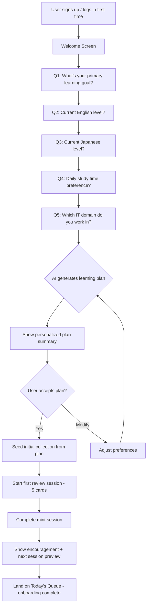
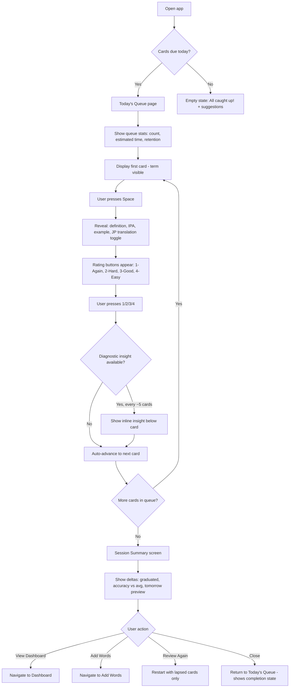
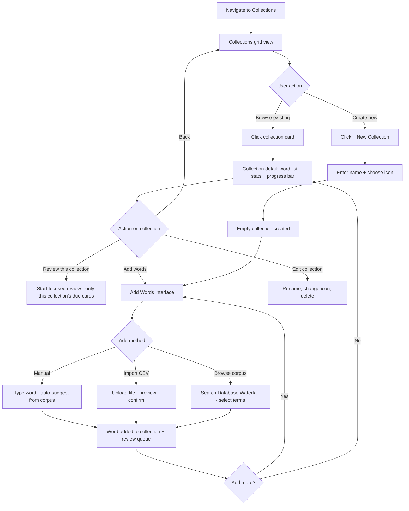
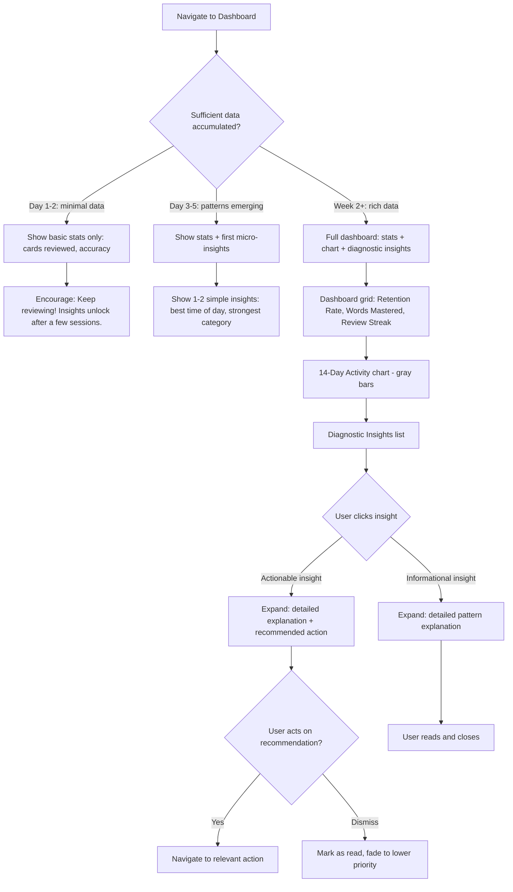

---
stepsCompleted:
  - "step-01-init"
  - "step-02-discovery"
  - "step-03-core-experience"
  - "step-04-emotional-response"
  - "step-05-inspiration"
  - "step-06-design-system"
  - "step-07-defining-experience"
  - "step-08-visual-foundation"
  - "step-09-design-directions"
  - "step-10-user-journeys"
  - "step-11-component-strategy"
  - "step-12-ux-patterns"
  - "step-13-responsive-accessibility"
  - "step-14-complete"
inputDocuments:
  - "prd.md"
  - "product-brief-table_project.md"
  - "product-brief-table_project-distillate.md"
  - "research/technical-vocabulary-learning-system-research-2026-04-30.md"
documentCounts:
  prd: 1
  briefs: 2
  research: 1
  projectDocs: 0
workflowType: 'ux-design'
classification:
  projectType: "web_app"
  domain: "data-driven edtech platform"
  complexity: "medium-high"
  projectContext: "greenfield"
---

# UX Design Specification table_project

**Author:** Lem
**Date:** 2026-05-02

---

## Executive Summary

### Project Vision

TableProject is a bilingual vocabulary mastery platform purpose-built for Vietnamese IT professionals and students acquiring English and Japanese technical vocabulary simultaneously. The platform differentiates through three pillars: (1) FSRS-powered spaced repetition with zero setup overhead, (2) a Learning Diagnostics Engine that diagnoses *why* specific words fail to stick and prescribes targeted interventions, and (3) a self-growing vocabulary corpus (Database Waterfall) that compounds with every user interaction.

The UX must embody the product's core philosophy: **serious learning, not gamification theater**. Every interaction should feel purposeful, efficient, and intelligence-driven. The platform targets desktop-first web usage (Next.js 16 PWA) with a path to mobile web optimization post-MVP.

Key UX promise: **From signup to first bilingual flashcard review in under 3 minutes.**

### Target Users

**Primary — Vietnamese IT Bilingual Learner (MVP focus)**

- **In Vietnam:** University students and early-career developers preparing for TOEIC and JLPT N2 simultaneously. They study at home on desktop, are price-sensitive, value efficiency over gamification, and need IT-specific vocabulary (code reviews, documentation, standups). These users are the MVP build target.
- **In Japan:** Vietnamese workers/engineers maintaining English for global tech work while improving Japanese for workplace survival. They learn during commutes (mobile web), need practical daily vocabulary, and have higher willingness to pay.

**Secondary**

- **JLPT/TOEIC test-takers:** Focused exam prep with structured vocabulary by JLPT level (N5–N1) or TOEIC score band. Need clear progress metrics toward exam readiness.
- **"Anki refugees":** Power users frustrated by Anki's deck-building overhead who want equivalent SRS effectiveness without the setup tax. Likely to import existing Anki decks via CSV/APKG.

**User Tech Savviness:** Intermediate to high — IT professionals and CS students comfortable with web applications. Not intimidated by data-rich dashboards but impatient with unnecessary complexity.

**Primary Device:** Desktop (laptop/monitor) for focused study sessions. Mobile web as secondary for quick reviews during commute.

### Key Design Challenges

1. **Bilingual Cognitive Load Management** — Presenting English and Japanese vocabulary simultaneously risks cognitive overload. The design must implement a clean single-language default view with an intuitive parallel mode toggle, making the transition between modes feel natural rather than mode-switching friction. The UX must clearly communicate when parallel mode adds value versus when single-language focus is optimal.

2. **Diagnostics as Personal Tutor, Not Data Dump** — The Learning Diagnostics Engine is the product's "aha moment" (target: 70% of 2-week users discover a previously unknown weakness). The dashboard must translate raw analytics into actionable, conversational insights — e.g., "Your networking terms drop 35% after 9pm — try morning sessions" — not scatter plots and percentages. The challenge is making intelligence feel human and immediately actionable.

3. **Zero-Friction Onboarding Flow** — The 5-question survey → AI-generated learning plan → first review path must complete in under 3 minutes. Every extra screen, loading state, or decision point risks abandonment. The UX must minimize cognitive decisions during onboarding while still gathering enough information to personalize the experience meaningfully.

4. **Cold-Start Dashboard Experience** — New users face an empty analytics dashboard for the first 1–2 weeks. The UX must design a compelling "day 1 through day 14" progressive reveal: estimated learning curves from FSRS parameters on Day 1, first pattern insights after 3 days of data, and full diagnostics by Week 2. Empty states must feel like anticipation, not absence.

5. **SRS Review Efficiency and "Chore Fatigue"** — Target users will complete 10+ reviews daily. The review flow must be optimized for speed (minimal clicks/taps per card), clear feedback loops, and session-level progress indicators that prevent the "endless grind" feeling. Keyboard shortcuts are essential for desktop power users.

### Design Opportunities

1. **"Amazon Review Dashboard" Concept** — A breakthrough UX pattern from brainstorming: weekly strategy sessions presented as star-rating breakdowns with recommendations and Q&A format. This transforms the typical learning dashboard from passive display into an active coaching conversation, creating a unique competitive advantage no vocabulary app currently offers.

2. **Shareable Diagnostic Reports as Growth Engine** — Every weakness analysis exported or shared becomes a product demo in Vietnamese study groups, Zalo communities, and tutor relationships. The UX for sharing must be frictionless and visually compelling — designed to spark curiosity in viewers who are not yet users.

3. **Progressive Disclosure of Intelligence** — Start simple (learn + review), then gradually surface Diagnostics Engine insights as user data accumulates. This creates a natural "aha moment" trajectory: Day 1 = clean SRS, Day 3 = first pattern hint, Week 2 = full diagnostic profile. The product gets smarter visibly, rewarding continued use.

4. **Single-Language to Parallel Mode Micro-Interactions** — The transition between single-language and parallel bilingual view is an opportunity for delightful micro-interactions that make cross-language exploration feel like discovery rather than mode-switching. Well-designed transitions here reinforce the product's unique bilingual value proposition.

## Core User Experience

### Defining Experience

**The review loop is the product.** TableProject lives or dies on the daily SRS review flow. The target user completes 10+ reviews per day — this is the interaction that must feel effortless, fast, and subtly rewarding. Every other feature (diagnostics, collections, enrichment) exists to make the review loop smarter and more effective over time.

The core loop: **Open app → See today's queue → Review cards one by one → Get session summary → Close.**

A single card review should take under 5 seconds for a "known" word and under 15 seconds for an "uncertain" word. The flow must be keyboard-driven (Anki-style 1/2/3/4 hotkeys for difficulty rating) with mouse/touch as fallback. Zero navigation required between cards — the next card appears automatically. Session progress is always visible but never distracting.

The secondary defining experience is the **diagnostic insight moment**: the first time a user sees a pattern they didn't know about themselves (e.g., "Your networking terms retention drops 35% in evening sessions"). This moment — targeted at ~2 weeks of usage — is what converts a "flashcard user" into a "TableProject user." But it depends entirely on the user having reviewed consistently for 2 weeks, which depends on the review flow being excellent.

### Platform Strategy

- **Primary platform:** Desktop web application (Next.js 16 PWA). Optimized for laptop/monitor with keyboard and mouse.
- **Secondary platform:** Mobile web (responsive). Optimized for quick review sessions during commute. Touch-friendly card interactions.
- **Input paradigm:** Keyboard-first on desktop (1/2/3/4 for card rating, Space to reveal answer, Enter to advance). Touch/tap on mobile.
- **Offline capability:** Deferred post-MVP. The architecture supports offline-first via IndexedDB (documented in technical research), but MVP ships online-only to reduce complexity. UI should be designed with offline-awareness in mind (no hard dependency on always-connected patterns) to enable seamless addition later.
- **Browser extension:** Post-MVP (weeks 15–18). Word capture from web pages via Plasmo. Not a UX design concern for MVP, but the vocabulary addition flow should anticipate this input channel.

### Effortless Interactions

**Must be completely frictionless:**

1. **Daily review start** — Open the app, today's queue is ready. No navigation, no "start session" button on the main view. The queue *is* the landing page for returning users.
2. **Card reveal and rating** — See prompt → Press Space to reveal → Press 1/2/3/4 to rate → Next card appears. Three keystrokes per card. No confirmation dialogs, no animations that block input.
3. **Adding vocabulary** — Search or type a term → system auto-enriches (definitions, IPA, CEFR, examples) → one click to add to personal collection and SRS queue. User never writes a definition manually unless they choose to.
4. **Onboarding** — 5 survey questions → AI generates learning plan → first review card appears. Under 3 minutes, under 10 clicks total.

**Should happen automatically without user intervention:**

- Review queue generation each day (FSRS scheduling runs server-side)
- LLM enrichment for unknown terms (triggered on lookup, results appear within seconds)
- Diagnostic pattern detection (runs in background as review data accumulates)
- Session statistics calculation (displayed at session end, no user action needed)

### Critical Success Moments

1. **First review session (Minute 3–5 of first visit):** The user completes their first 5–10 card reviews and thinks "this is fast and clean." If this moment feels clunky, onboarding fails regardless of the survey and learning plan quality. The cards must be pre-seeded, the flow must be instant, and the rating interaction must feel obvious.

2. **First "I know this" streak (Day 2–3):** The user returns and discovers that FSRS has correctly scheduled cards — the ones they rated "Easy" yesterday don't appear, while the "Hard" ones do. This builds trust in the system's intelligence. The UX should subtly surface this: "3 cards mastered yesterday" or similar micro-feedback.

3. **Diagnostic "aha" moment (Week 2):** The dashboard surfaces a genuine insight: "Your networking terms retention drops 35% in evening sessions — consider reviewing technical vocabulary in the morning." This is the moment that differentiates TableProject from every other SRS tool. The UX must frame this as a personal coaching insight, not a chart annotation.

4. **Collection curation (Week 1–2):** The user organizes vocabulary into meaningful collections (e.g., "JLPT N3 Kanji," "Code Review Terms") and feels ownership over their learning path. The collection management flow must be drag-and-drop simple, not spreadsheet-like.

5. **Sharing a diagnostic report (Week 3+):** The user exports or shares their weakness analysis in a study group. This moment serves double duty: it validates the user's investment ("look what I learned about my learning") and acts as organic product marketing.

### Experience Principles

1. **Speed is respect.** Every interaction should complete in the minimum possible time. Review flow: 3 keystrokes per card. Adding a word: 2 clicks. Loading a page: under 200ms perceived. Users are busy IT professionals — wasting their time is the fastest way to lose them.

2. **Intelligence, not decoration.** No XP bars, no streaks, no confetti animations. When the system communicates with the user, it should feel like a knowledgeable tutor — specific, evidence-based, actionable. "Your retention for X drops Y% when Z" beats "Great job! Keep it up!" every time.

3. **Progressive revelation.** Day 1: clean, focused review flow. Day 3: first hint of pattern detection. Week 2: full diagnostic profile. Week 4: advanced analytics and cross-language insights. The product gets visibly smarter over time, rewarding consistent use without overwhelming new users.

4. **Keyboard-first, touch-friendly.** Desktop power users should never need to reach for the mouse during a review session. Mobile users should find every interaction tap-accessible. Design for keyboard, ensure touch works.

5. **Single-language focus, bilingual on demand.** Default to one language per card (low cognitive load). Parallel bilingual mode is a conscious choice, not the default. The toggle should be discoverable but not prominent — most review sessions benefit from single-language focus.

## Desired Emotional Response

### Primary Emotional Goals

**"I'm genuinely getting better — and I can feel it."**

The primary emotional target is **quiet competence with visible evidence**. Users should finish each review session feeling measurably smarter, not just "done." This is the antidote to both gamification theater (Duolingo's hollow XP) and grind fatigue (Anki's endless grey cards).

Three emotional pillars:

1. **Momentum, not repetition.** Each review session should feel like forward movement — words graduating from "struggling" to "known," new patterns emerging, the vocabulary landscape visibly shifting. The user never feels stuck in a loop because the system constantly surfaces what's changing.

2. **Evidence-based confidence.** Users should feel confident in their progress because the system shows concrete proof: retention curves trending upward, mastery counts growing, diagnostic insights confirming improvement. Not badges or streaks — data that respects their intelligence.

3. **Discovery over routine.** The Diagnostics Engine creates recurring micro-discoveries ("Oh, I didn't know that about my learning pattern") that break the monotony of standard SRS review. Every week brings a new insight, keeping the experience intellectually engaging even as the core action (review cards) remains the same.

### Emotional Journey Mapping

| Stage | User Feels | Design Implication |
|-------|-----------|-------------------|
| **First discovery** (landing page) | "This looks serious and clean — not another toy" | Minimal, professional aesthetic. No mascots, no bright gamification colors. Show the diagnostic insight as hero feature. |
| **Onboarding** (minutes 1–3) | "This is fast and respects my time" | Maximum 5 questions, visible progress, immediate payoff (first card review within 3 minutes). |
| **First review session** (minutes 3–8) | "This flow is satisfying — I could do this daily" | Keyboard-driven speed, subtle micro-feedback on each card (not celebration, just acknowledgment), session progress bar. |
| **Day 2–3 return** | "It remembered. The hard ones are back, the easy ones aren't." | Surface FSRS intelligence: "3 cards mastered yesterday." Trust builds through visible scheduling accuracy. |
| **Week 1 routine** | "This fits my day without feeling like homework" | Session length estimates ("~5 min today"), flexible exit points, no guilt for partial sessions. |
| **Week 2 diagnostic unlock** | "Wait — I didn't know that about myself" | The "aha" moment. First diagnostic insight delivered as a personal coaching note, not a chart. This is the emotional peak that converts casual users to committed ones. |
| **Week 3+ mastery** | "I can see my vocabulary growing. This actually works." | Vocabulary landscape visualization, mastery milestones that feel earned (not arbitrary), sharable progress snapshots. |
| **Something goes wrong** (error/confusion) | "I know what happened and how to fix it" | Clear, non-technical error messages. Never lose review progress. Graceful degradation over hard failures. |

### Micro-Emotions

**Prioritized emotional states:**

- **Confidence over confusion** — Every interaction should feel predictable and clear. The user always knows what to do next, what a rating means, where they stand. No ambiguous UI states.
- **Curiosity over boredom** — The #1 emotional threat. Combat through: varying card presentation (context sentences, related terms, cross-language hints), diagnostic micro-discoveries, vocabulary growth visualizations that change weekly. The review flow must feel like a living system, not a static flashcard deck.
- **Accomplishment over guilt** — Never punish missed days. Instead of "You missed 3 days!" show "Welcome back — here's what's ready for you." Session completion feels satisfying through a brief summary ("12 reviewed, 3 mastered, 1 new pattern detected") — not through streaks or loss-aversion mechanics.
- **Trust over skepticism** — FSRS scheduling must feel right. When a card reappears, the user should intuitively agree ("yes, I was about to forget this one"). JMdict-validated content builds trust in accuracy. Transparency about how the system works (optional "why this card now?" tooltip) reinforces trust.

**Emotions to actively prevent:**

- **Boredom/monotony** — The existential threat to any SRS product. Mitigate through session variety (diagnostic hints, milestone markers, cross-language discoveries interspersed with standard reviews), dynamic session lengths, and the progressive intelligence reveal that keeps the product feeling "new" over weeks.
- **Guilt** — No streak counters, no "you've been away" shaming, no loss-framing. The product welcomes users back warmly after any absence.
- **Overwhelm** — Progressive disclosure prevents information overload. New users see a clean review flow; complexity reveals itself gradually as usage data accumulates.
- **Distrust** — Never show a Japanese definition that hasn't been JMdict-validated. Never schedule a card at an obviously wrong interval. One trust violation can undo weeks of goodwill.

### Design Implications

| Emotional Goal | UX Design Approach |
|---------------|-------------------|
| Momentum, not repetition | Session summary shows cards *graduated* this session, not just cards reviewed. Progress visualization emphasizes change over time, not absolute numbers. |
| Evidence-based confidence | Retention curves, mastery counts, and diagnostic insights use real data, presented conversationally. "Your IT vocabulary retention improved 12% this week" > progress bar at 67%. |
| Discovery over routine | Intersperse diagnostic micro-insights within review sessions (every 15–20 cards). Vary card presentation format slightly across sessions. Surface "did you know?" facts about user's own learning patterns. |
| Anti-boredom | Dynamic session composition — mix review types, insert brief diagnostic moments, show vocabulary growth milestones mid-session. Never let 20+ cards pass without some variety signal. |
| Anti-guilt | Return-after-absence screen shows opportunity ("24 cards ready"), not deficit ("You missed 3 days"). No streaks in primary UI. Optional streak tracking buried in settings for users who want it. |
| Anti-overwhelm | Progressive disclosure: Week 1 = review + basic stats. Week 2 = diagnostics unlock. Week 3+ = full analytics available. Never force complexity on users who haven't asked for it. |

### Emotional Design Principles

1. **Show the delta, not the state.** Users care about *change* ("5 new words mastered this week") more than *position* ("you know 247 words"). Delta-oriented feedback creates momentum and fights the feeling of stagnation that causes boredom.

2. **Earn celebration, don't manufacture it.** No confetti for reviewing 10 cards. But when a user masters a word they've struggled with for 2 weeks — that deserves a subtle, genuine acknowledgment. Celebrate real achievements, ignore routine actions.

3. **Welcome, never shame.** Every return to the app — whether after 1 day or 30 days — should feel like opening a book where you left off, not walking into a disappointed classroom. The system adapts to absence (FSRS reschedules naturally); the UI should too.

4. **Intelligence creates engagement.** The Diagnostics Engine is not just an analytics feature — it's the primary anti-boredom mechanism. Each new insight gives the user a reason to keep going that transcends the repetitive nature of SRS review. Design diagnostic reveals as moments of genuine discovery.

5. **Respect over delight.** For IT professionals, respecting their time and intelligence creates more loyalty than delightful animations. Clean, fast, informative > cute, slow, surprising. When in doubt, remove rather than add.

## UX Pattern Analysis & Inspiration

### Inspiring Products Analysis

**Notion** — Primary Inspiration (with caveats)

Notion succeeds because it gives users ownership: a blank canvas that becomes *their* system. For TableProject, the transferable lesson is not Notion's workspace-building paradigm (TableProject is a daily repetition tool, not a system builder), but rather Notion's **design philosophy**: progressive disclosure, clean typography, keyboard-driven interactions, and UI that disappears when the user is focused.

Key UX strengths: block-based simplicity, slash commands for keyboard-first interaction, whitespace-heavy design that lets content breathe, complexity that reveals itself only when sought. The trap to avoid: copying Notion's navigation patterns (sidebar, nested pages) into a product where the core action is reviewing flashcards, not organizing information.

**Anki** — Domain Reference (keyboard flow)

Anki's 1/2/3/4 keyboard rating system is the gold standard for SRS review speed. Millions of users have validated this interaction pattern. TableProject adopts this wholesale — but rejects Anki's aesthetic (dated, intimidating) and configuration complexity (deck building, note type setup). The lesson: copy the *interaction*, not the *interface*.

**Duolingo** — Domain Reference (onboarding)

Duolingo's zero-friction onboarding (placement test → first lesson in under 60 seconds) is best-in-class. TableProject adapts this approach: 5-question survey → AI-generated learning plan → first review card. The anti-lesson: Duolingo's guilt mechanics (streaks, hearts, leagues) directly conflict with TableProject's "welcome, never shame" emotional design principle.

### Transferable UX Patterns

**Review Flow as Center of Gravity (from Anki + Notion philosophy)**

The review loop is the product's core — not navigation, not the dashboard, not collections. Every design decision radiates outward from "3 keystrokes per card." The app opens to today's queue. No "start session" button, no navigation required. This is the single most important UX decision: the review flow *is* the home screen for returning users.

- Keyboard shortcuts: Space (reveal) → 1/2/3/4 (rate) → next card auto-advances
- Session progress: subtle, non-blocking indicator (e.g., "7/24" in corner)
- Session end: brief summary (cards reviewed, cards graduated, patterns detected)

**Progressive Intelligence Reveal (adapted from Notion's progressive disclosure)**

Notion reveals complexity as users explore. TableProject reveals *intelligence* as user data accumulates — a critical distinction. The product doesn't hide features behind menus; it unlocks insights as they become statistically meaningful:

- Day 1: Clean review flow + basic stats ("12 cards reviewed today")
- Day 3–5: First micro-insight after ~50–80 reviews ("You learn IT terms 20% faster in the morning" — even a rough signal creates an early "aha" moment)
- Week 2: Full diagnostic profile with actionable recommendations
- Week 3+: Cross-language interference patterns, advanced analytics

This differs from Notion: Notion's disclosure is feature-gated (user discovers features). TableProject's disclosure is data-gated (insights unlock as data accumulates). The user doesn't need to explore — the product comes to them.

**Command Palette (adapted from Notion's slash commands)**

A `Ctrl+K` / `Cmd+K` command palette for quick actions: search vocabulary, add a term, switch collection, start a review session. This pattern respects power users' keyboard-first habits while keeping the main UI uncluttered.

Implementation note: This is a Sprint 2+ feature. Requires full-text search indexing on vocabulary terms (PostgreSQL `tsvector`). MVP can ship with a simpler search bar; command palette upgrades the interaction without changing the architecture.

**Clean, Content-First Aesthetic (from Notion)**

Whitespace-heavy layout, professional typography, muted color palette. No mascots, no decorative illustrations, no gamification chrome. The interface should feel like a well-designed developer tool — clean, fast, informative.

Bilingual typography consideration: Japanese text (kanji, hiragana, katakana) requires careful font selection and spacing. The design system must account for mixed-script rendering — Latin + Japanese + Vietnamese diacritics in the same card view. Font stack should prioritize readability across all three scripts.

### Anti-Patterns to Avoid

| Anti-Pattern | Why It Fails for TableProject | Source |
|---|---|---|
| Gamification theater (XP, streaks, leagues) | Conflicts with "serious learning" principle; target users are IT professionals who see through engagement tricks | Duolingo |
| Configuration-heavy onboarding | Breaks "under 3 minutes to first review" promise; setup tax is the #1 reason Anki loses casual users | Anki |
| Workspace-building mental model | Users want to learn vocabulary, not build a system; Notion's "organize everything" paradigm doesn't map to daily SRS repetition | Notion (misapplied) |
| Modal dialogs in review flow | Any popup that interrupts the Space → 1/2/3/4 → next cycle adds friction to the most-repeated interaction | General |
| Empty dashboard without guidance | New users seeing blank analytics will feel the product is broken; cold-start must show projections, not emptiness | General |
| Desktop-only keyboard assumptions | Ctrl+K and 1/2/3/4 shortcuts don't exist on mobile; touch alternatives (tap zones, swipe gestures) must be designed in parallel | Mobile UX |
| Real-time inline editing (Notion-style) | Adds massive implementation complexity (conflict detection, optimistic updates, undo/redo) for minimal learning-flow value at MVP | Notion (over-adopted) |

### Design Inspiration Strategy

**Adopt (use directly):**
- Anki's keyboard-first review flow (Space → 1/2/3/4 → auto-advance) — proven by millions of users
- Notion's content-first aesthetic — whitespace, clean typography, UI that disappears during focus

**Adapt (modify for context):**
- Notion's progressive disclosure → TableProject's **progressive intelligence reveal** (data-gated, not feature-gated; insights unlock as review data accumulates, including a micro-aha moment as early as Day 3–5)
- Notion's slash commands → **Ctrl+K command palette** (Sprint 2+; simpler search bar at MVP)
- Notion's sidebar → **minimal navigation shell** (Today's Queue, Collections, Dashboard, Settings — no nested hierarchy, no workspace-building metaphor)
- Duolingo's zero-config onboarding → **5-question survey + AI learning plan** (keep the speed, add the personalization)

**Avoid (explicitly reject):**
- Duolingo's guilt mechanics — no streaks, no "you've been away" shaming
- Anki's configuration complexity — zero setup overhead
- Notion's workspace-building paradigm — TableProject is a daily learning tool, not an organizational system
- Notion-style real-time inline editing at MVP — defer to post-MVP; use simple edit-and-save pattern instead
- Desktop-only UX assumptions — design keyboard shortcuts AND touch alternatives from the start

**Guiding Philosophy:**
The review flow is the product. Navigation, dashboard, collections, and settings exist to make the review flow smarter and more effective over time. When in doubt about any UX decision, ask: "Does this make the next review session better?" If not, defer it.

## Design System Foundation

### Design System Choice

**shadcn/ui + Tailwind CSS** with Radix UI primitives as the component foundation for TableProject.

shadcn/ui is not a traditional component library — it is a collection of copy-paste components built on Radix UI primitives and styled with Tailwind CSS. Components are owned by the project (not an external dependency), giving full control over behavior and appearance while starting from accessible, well-tested defaults.

### Rationale for Selection

| Factor | Assessment |
|---|---|
| **Timeline fit** | 14-week MVP with solo/small team demands speed. shadcn/ui provides production-ready components (buttons, dialogs, cards, command palette, tables, forms) out of the box — no sprint spent building a design system from scratch. |
| **Customization** | Components live in the project codebase (`components/ui/`), not in `node_modules`. Every component can be modified without fighting library abstractions. Critical for the bilingual card layouts and review flow that have no off-the-shelf equivalent. |
| **Accessibility** | Radix UI primitives provide ARIA attributes, keyboard navigation, focus management, and screen reader support by default. Essential for the keyboard-first review flow (Space, 1/2/3/4 hotkeys) and command palette (Ctrl+K). |
| **Aesthetic alignment** | shadcn/ui's default aesthetic — clean, minimal, whitespace-heavy — directly matches the "serious developer tool" visual direction from the inspiration analysis. Minimal override work needed to achieve the target look. |
| **Ecosystem fit** | Native to the Next.js + TypeScript + Tailwind stack already chosen. No adapter layers, no CSS-in-JS runtime, no style conflicts. |
| **Bilingual typography** | Tailwind's utility classes make it straightforward to define font stacks, line heights, and spacing rules for mixed-script rendering (Latin + Japanese + Vietnamese). Custom CSS is minimal and co-located with components. |
| **Community & maintenance** | Large active community, frequent updates, extensive documentation. Components follow Radix UI's stability guarantees. |

### Implementation Approach

**Component adoption strategy:**

- **Sprint 1:** Install shadcn/ui CLI, initialize with project theme tokens (colors, typography, spacing, border radius). Adopt core components: Button, Card, Input, Dialog, Badge, Tooltip, Progress.
- **Sprint 2:** Add Command component (for Ctrl+K palette), Table, Tabs, Sheet (mobile sidebar). Customize Card component for vocabulary card review layout.
- **Sprint 3+:** Build custom composite components on top of shadcn/ui primitives — ReviewCard, DiagnosticInsight, SessionSummary, VocabularySearch. These are project-specific and won't exist in any library.

**Theme configuration:**

Design tokens defined in `tailwind.config.ts` and `globals.css`:
- Colors: Neutral-heavy palette (slate/zinc) with one accent color for actionable elements
- Typography: Inter (Latin/Vietnamese) + Noto Sans JP (Japanese) — both variable fonts
- Spacing: 4px base unit, consistent across components
- Border radius: Subtle (6-8px) — professional, not playful
- Dark mode: Supported via CSS variables (Tailwind's class strategy)

### Customization Strategy

**What stays default:** Button variants, form inputs, tooltips, dialogs, dropdown menus — these work well out of the box and benefit from Radix UI's accessibility guarantees.

**What gets customized:**

- **Card component** — extended for vocabulary review cards with bilingual layout, reveal animation (Space key), and difficulty rating zones (1/2/3/4 buttons or tap targets)
- **Command component** — customized for vocabulary search with result categories (terms, collections, actions) and bilingual search results
- **Progress indicators** — custom session progress (non-blocking, corner-positioned) and diagnostic insight cards
- **Navigation shell** — minimal sidebar with 4 items (Today's Queue, Collections, Dashboard, Settings), collapsible on mobile
- **Typography system** — multi-script font stack with language-aware line-height and letter-spacing rules

**Design token evolution:** Start with shadcn/ui defaults, refine based on user feedback during beta. The copy-paste ownership model means tokens can evolve without version conflicts or breaking changes from upstream.

## Detailed Core User Experience

### Defining Experience

**"Open, review, done."** — The defining experience of TableProject is a vocabulary review flow so fast and frictionless that it feels like muscle memory after the first session.

The user opens the app. Today's queue is already waiting — no navigation, no "start session" button, no decisions. Press Space to reveal the answer. Press 1, 2, 3, or 4 to rate difficulty. The next card appears instantly. Three keystrokes per card. A 20-card session completes in under 3 minutes.

This is the interaction users will describe to their friends: *"I just open it and go. No setup, no clicking around. Space, rate, next. It's the fastest SRS review I've ever used."*

The review flow is not a feature — it is the product. Every other capability (diagnostics, collections, enrichment, dashboard) exists to make this 3-keystroke loop smarter over time, but none of them matter if this loop doesn't feel instant, obvious, and satisfying.

### User Mental Model

**What users bring:** Target users (Vietnamese IT devs/students) arrive with one of two mental models:

- **"Anki veteran"** — Knows SRS, expects 1/2/3/4 keyboard shortcuts, tolerates ugly UI but demands scheduling accuracy. Their frustration: setup time and deck maintenance. They want Anki's engine without Anki's overhead.
- **"Duolingo dropout"** — Tried gamified learning, felt it was shallow, wants something serious but not intimidating. Their frustration: wasted time on irrelevant vocabulary and engagement tricks. They want depth without complexity.

**The bridge:** TableProject's review flow satisfies both. The Anki veteran gets their keyboard shortcuts and accurate FSRS scheduling in a clean interface. The Duolingo dropout gets immediate, zero-config access to pre-seeded vocabulary with no gamification noise.

**Mental model for the review action itself:** Users think of card review as a binary reveal — "show me the question, then show me the answer." The 4-point difficulty rating (Again / Hard / Good / Easy) maps to an intuitive self-assessment: *"Did I know this?"* The system handles the scheduling math invisibly. Users should never need to understand FSRS to benefit from it.

### Success Criteria

The review flow succeeds when:

| Criterion | Target | Measurement |
|---|---|---|
| **Keystrokes per card** | 3 (Space + rating + auto-advance) | Interaction audit |
| **Time per "known" card** | < 5 seconds | Session analytics |
| **Time per "uncertain" card** | < 15 seconds | Session analytics |
| **Time to start reviewing** | 0 seconds after app load (queue is the landing page) | Page load metrics |
| **Cards per minute** | 12+ for experienced users | Session analytics |
| **Zero-error rating** | User never accidentally rates a card wrong due to UI ambiguity | User testing |
| **Session completion rate** | > 80% of started sessions completed | Analytics |
| **"It just works" sentiment** | Users report review flow as the #1 reason they stay | In-app survey at 2 weeks |

### Novel UX Patterns

The review flow itself uses **established patterns** — Anki proved the Space → rate → next cycle works. TableProject's innovation is not in the review interaction but in what surrounds it:

**Established patterns (adopt directly):**
- Space to reveal answer (universal flashcard convention)
- 1/2/3/4 keyboard shortcuts for difficulty rating (Anki standard)
- Auto-advance to next card (no "Next" button needed)
- Session progress indicator (subtle counter: "7/24")

**Novel patterns (TableProject innovations):**

- **Diagnostic micro-insertions:** Every 15–20 cards, a brief insight card appears within the review flow — not as a separate dashboard visit, but inline: *"Quick insight: your networking terms retain 20% better in morning sessions."* This breaks monotony and delivers the Diagnostics Engine's value inside the core experience, not outside it.
- **Session-end intelligence summary:** Instead of "You reviewed 24 cards" (Anki), the summary surfaces meaningful deltas: *"3 cards graduated to mastered. 1 new pattern detected. Estimated 15-min session tomorrow."* This connects each session to long-term progress.
- **Single-language default with contextual parallel toggle:** During review, cards show one language by default (matching the user's active study mode). A subtle toggle or keyboard shortcut (e.g., `Tab`) reveals the parallel bilingual view for that card only — not a global mode switch but a per-card exploration gesture.
- **Warm return screen:** After absence (1+ days), the app doesn't guilt ("You missed 3 days!") or celebrate ("Welcome back!"). It simply shows the queue with a brief context line: *"24 cards ready. ~4 min estimated."* The system adapted to the absence silently (FSRS rescheduled); the UI reflects that composure.

### Experience Mechanics

**1. Initiation**

The user opens the app. The landing page for returning users IS the review queue — no homepage, no dashboard-first, no navigation required.

```
┌─────────────────────────────────────┐
│  TableProject          [Ctrl+K] ≡  │
│─────────────────────────────────────│
│                                     │
│         24 cards ready              │
│         ~4 min estimated            │
│                                     │
│  ┌─────────────────────────────┐    │
│  │                             │    │
│  │       network (n.)          │    │
│  │                             │    │
│  │    Press Space to reveal    │    │
│  │                             │    │
│  └─────────────────────────────┘    │
│                                     │
│              1/24                   │
└─────────────────────────────────────┘
```

First-time users see the same layout but with a 3-step onboarding overlay (5 questions → AI plan → first card). After onboarding, the overlay disappears permanently.

**2. Interaction — The Review Cycle**

```
State 1: PROMPT (card front)
  → User sees: term + language indicator
  → Action: Press Space (or tap card on mobile)

State 2: REVEAL (card back)
  → User sees: definition, IPA, example sentence, CEFR level
  → Optional: Press Tab to toggle parallel bilingual view
  → Action: Press 1 (Again) / 2 (Hard) / 3 (Good) / 4 (Easy)
  → Mobile: Tap one of four rating buttons below the card

State 3: TRANSITION (instant)
  → Previous card slides out, next card slides in
  → No animation longer than 150ms
  → Session counter updates: "2/24"
  → Return to State 1
```

**Keyboard mapping:**
- `Space` — Reveal answer
- `1` — Again (forgot completely, reschedule soon)
- `2` — Hard (struggled, shorter interval)
- `3` — Good (knew it, standard interval)
- `4` — Easy (effortless, longer interval)
- `Tab` — Toggle parallel bilingual view (on revealed card only)
- `Esc` — End session early (with summary)

**Mobile touch mapping:**
- Tap card — Reveal answer
- Tap rating button — Rate and advance (four buttons: Again / Hard / Good / Easy)
- Swipe left — End session early

**3. Feedback**

- **Per-card:** Subtle color flash on rating (neutral tones, not gamified — e.g., soft amber for "Again", soft green for "Easy"). Duration: 100ms. No sound effects.
- **Milestone micro-feedback:** At card 10, 20, etc., a brief non-blocking line appears: *"10 reviewed — 2 graduated this session"*. Disappears after 2 seconds.
- **Diagnostic insertion (every 15–20 cards):** A special insight card appears in the flow — visually distinct (different background, icon) but same interaction model (read → Space → continue). Example: *"Quick insight: You rated 'protocol' as Hard 3 times this week. Consider reviewing networking terms in morning sessions."*
- **Error prevention:** No "undo" button to prevent second-guessing, which slows the flow. If a user mis-presses, the FSRS algorithm self-corrects over subsequent reviews — one wrong rating has negligible impact on long-term scheduling.

**4. Completion**

When the last card is reviewed, a session summary replaces the card area:

```
┌─────────────────────────────────────┐
│  Session Complete                   │
│─────────────────────────────────────│
│                                     │
│  24 cards reviewed in 3m 42s        │
│                                     │
│  ✦ 3 cards graduated to mastered    │
│  ✦ 1 new pattern detected           │
│  ✦ Tomorrow: ~18 cards, ~3 min      │
│                                     │
│  [View Dashboard]    [Add Words]    │
└─────────────────────────────────────┘
```

The summary emphasizes **deltas** (what changed) over **absolutes** (total reviewed). "3 cards graduated" matters more than "24 reviewed." The "new pattern detected" line links to the Diagnostics dashboard — this is the bridge between the daily review habit and the diagnostic "aha" moment.

No confetti. No streaks. No XP. Just clear, intelligent feedback that respects the user's time.

## Visual Design Foundation

### Color System

**Palette Philosophy:** Warm neutral base with a single purposeful accent. The palette should feel like a well-lit desk — calm, professional, but not sterile. Inspired by Notion and Stripe's warmth rather than Vercel's cool minimalism.

**Semantic Color Tokens:**

| Token | Light Mode | Dark Mode | Usage |
|---|---|---|---|
| `--background` | `#FAFAF9` (warm white) | `#1C1C1E` (soft black) | Page background |
| `--surface` | `#FFFFFF` | `#2C2C2E` | Cards, panels, elevated surfaces |
| `--surface-hover` | `#F5F5F4` | `#3A3A3C` | Interactive surface hover state |
| `--border` | `#E7E5E4` (stone-200) | `#3A3A3C` | Dividers, card borders |
| `--text-primary` | `#1C1917` (stone-900) | `#FAFAF9` | Headings, primary content |
| `--text-secondary` | `#78716C` (stone-500) | `#A8A29E` | Labels, secondary info, metadata |
| `--text-muted` | `#A8A29E` (stone-400) | `#78716C` | Placeholders, hints |
| `--accent` | `#2563EB` (blue-600) | `#3B82F6` (blue-500) | Primary actions, links, active states |
| `--accent-hover` | `#1D4ED8` (blue-700) | `#60A5FA` (blue-400) | Accent hover state |
| `--accent-subtle` | `#EFF6FF` (blue-50) | `#1E3A5F` | Accent backgrounds (selected items, badges) |

**Feedback Colors (muted, not gamified):**

| Token | Light Mode | Dark Mode | Usage |
|---|---|---|---|
| `--rating-again` | `#FEF2F2` (red-50) | `#3B1C1C` | "Again" rating flash — soft, not alarming |
| `--rating-hard` | `#FFFBEB` (amber-50) | `#3B2E1C` | "Hard" rating flash |
| `--rating-good` | `#F0FDF4` (green-50) | `#1C3B2E` | "Good" rating flash |
| `--rating-easy` | `#EFF6FF` (blue-50) | `#1C2E3B` | "Easy" rating flash |
| `--success` | `#16A34A` (green-600) | `#4ADE80` | Mastery indicators, positive deltas |
| `--warning` | `#D97706` (amber-600) | `#FBBF24` | Attention needed, diagnostic alerts |
| `--error` | `#DC2626` (red-600) | `#F87171` | Errors, destructive actions |
| `--info` | `#2563EB` (blue-600) | `#60A5FA` | Informational, diagnostic insights |

**Color Principles:**
- Warm stone tones (Tailwind `stone` scale) as the neutral base — warmer than `slate` or `zinc`, avoiding the cold "developer tool" feel
- Single accent color (blue) for all interactive elements — no color proliferation
- Rating feedback uses background tints, not solid colors — subtle, 100ms flash, then gone
- Diagnostic insight cards use `--info` background tint to visually distinguish from vocabulary cards
- High contrast ratios: all text meets WCAG AA (4.5:1 for body, 3:1 for large text)

### Typography System

**Font Stack:**

| Role | Font | Weight Range | Fallback |
|---|---|---|---|
| **Latin + Vietnamese** | Inter Variable | 400–700 | system-ui, -apple-system, sans-serif |
| **Japanese** | Noto Sans JP Variable | 400–700 | "Hiragino Sans", "Yu Gothic", sans-serif |
| **Monospace** (IPA, code) | JetBrains Mono | 400 | "Fira Code", monospace |

**Why these fonts:**
- **Inter** — Designed for screens, excellent Latin + Vietnamese diacritics support, variable font (single file, multiple weights). The default for modern web apps (Vercel, Linear, Notion-adjacent aesthetic).
- **Noto Sans JP** — Google's comprehensive Japanese font covering all JIS kanji levels. Variable font minimizes load. Clean, neutral aesthetic that pairs well with Inter without competing visually.
- **JetBrains Mono** — For IPA transcriptions and code-related vocabulary terms. Familiar to the IT professional target audience.

**Type Scale (based on 16px base):**

| Level | Size | Line Height | Weight | Usage |
|---|---|---|---|---|
| `display` | 30px / 1.875rem | 1.2 | 700 | Dashboard headlines only |
| `h1` | 24px / 1.5rem | 1.3 | 700 | Page titles |
| `h2` | 20px / 1.25rem | 1.4 | 600 | Section headers |
| `h3` | 16px / 1rem | 1.5 | 600 | Card headers, subsections |
| `body` | 16px / 1rem | 1.6 | 400 | Primary reading text |
| `body-sm` | 14px / 0.875rem | 1.5 | 400 | Secondary text, metadata, labels |
| `caption` | 12px / 0.75rem | 1.4 | 400 | Timestamps, counters, hints |
| `vocab-term` | 20px / 1.25rem | 1.4 | 600 | Vocabulary term on card front |
| `vocab-reading` | 16px / 1rem | 1.5 | 400 | IPA, furigana, pronunciation |
| `vocab-definition` | 16px / 1rem | 1.6 | 400 | Definition text on card back |

**Bilingual Typography Rules:**
- Japanese text receives +2px line-height adjustment relative to Latin text at the same font size (kanji requires more vertical breathing room)
- Furigana (ruby text) renders at 50% of parent font size, positioned above kanji
- Mixed-script lines (e.g., "ネットワーク (network)") use Inter for Latin characters and Noto Sans JP for Japanese, with automatic font-family switching via CSS `unicode-range`
- Vietnamese diacritics (ă, ơ, ư, etc.) render correctly in Inter without additional configuration

### Spacing & Layout Foundation

**Base Unit:** 4px

All spacing values are multiples of 4px, creating a consistent rhythm:

| Token | Value | Usage |
|---|---|---|
| `--space-1` | 4px | Tight gaps (icon-to-text, inline elements) |
| `--space-2` | 8px | Compact spacing (list items, form field padding) |
| `--space-3` | 12px | Default component padding |
| `--space-4` | 16px | Section spacing, card padding |
| `--space-6` | 24px | Between content blocks |
| `--space-8` | 32px | Major section separation |
| `--space-12` | 48px | Page-level spacing |
| `--space-16` | 64px | Hero/feature section spacing |

**Layout Structure:**

```
┌──────────────────────────────────────────────┐
│  Top Bar (56px height, fixed)                │
│  Logo + Ctrl+K search + user avatar          │
├────────┬─────────────────────────────────────┤
│        │                                     │
│ Side-  │   Main Content Area                 │
│ bar    │   (max-width: 720px, centered)      │
│        │                                     │
│ 240px  │   Review cards, dashboard panels,   │
│ width  │   collection views                  │
│        │                                     │
│ Colla- │                                     │
│ psible │                                     │
│        │                                     │
├────────┴─────────────────────────────────────┤
│  (No footer — unnecessary for this app)      │
└──────────────────────────────────────────────┘
```

**Layout Principles:**

1. **Content-centered:** Main content area is max 720px wide (optimal reading width for mixed-script text), centered horizontally. No edge-to-edge layouts except on mobile.
2. **Sidebar as navigation, not workspace:** 4 items only (Today's Queue, Collections, Dashboard, Settings). Collapsible to icon-only (56px) on desktop, hidden behind hamburger on mobile. During review flow, sidebar auto-collapses to maximize focus.
3. **Card as primary content unit:** Vocabulary cards, diagnostic insight cards, and session summary cards all share the same Card component dimensions and padding (`--space-4` internal padding, `--space-6` between cards). Consistent card rhythm across all views.
4. **Vertical rhythm:** All content flows vertically. No horizontal scrolling. Dashboard panels stack vertically on smaller screens.
5. **Review flow maximizes focus:** During active review, the sidebar collapses and the top bar minimizes to just the session counter and Esc hint. The card occupies the visual center.

**Responsive Breakpoints:**

| Breakpoint | Width | Layout Change |
|---|---|---|
| `mobile` | < 640px | Sidebar hidden, full-width cards, touch-optimized rating buttons |
| `tablet` | 640–1024px | Sidebar icon-only (56px), cards fill available width |
| `desktop` | > 1024px | Full sidebar (240px), content centered at max 720px |

### Accessibility Considerations

**Color Contrast:**
- All body text on background: minimum 7:1 contrast ratio (WCAG AAA)
- All interactive elements: minimum 4.5:1 (WCAG AA)
- Rating feedback colors are background tints only — never used as the sole indicator. Rating buttons always include text labels ("Again", "Hard", "Good", "Easy")

**Keyboard Navigation:**
- Full keyboard operability for all interactions (review flow, navigation, command palette)
- Visible focus indicators: 2px blue outline (`--accent`) with 2px offset on all focusable elements
- Skip-to-content link for screen readers
- Tab order follows visual layout (left-to-right, top-to-bottom)

**Screen Reader Support:**
- ARIA labels on all interactive elements (provided by Radix UI primitives)
- Card content structured with semantic HTML (`<article>`, `<h2>`, `<p>`)
- Rating buttons announced as "Rate as Again", "Rate as Hard", etc.
- Session progress announced via `aria-live="polite"` region

**Motion:**
- All animations respect `prefers-reduced-motion` — users who disable motion see instant state changes instead of transitions
- Card transition (150ms slide) degrades to instant swap
- Rating color flash degrades to no flash

**Font Sizing:**
- All text scales with browser font-size settings (rem-based, not px-fixed)
- Minimum interactive target: 44x44px (touch) per WCAG 2.5.5

## Design Direction Decision

### Design Directions Explored

Six design direction approaches were evaluated through an interactive HTML showcase (`ux-design-directions.html`), all built on the Notion-Inspired (Direction 4) foundation — typography-driven, borderless, flat, document-flow aesthetic. The exploration focused on color palette variations rather than structural changes, as the layout and interaction patterns were already validated in previous steps.

**Key palette explorations:**
1. **Warm stone palette** (original) — cream/beige undertones, warm grays
2. **Full dark mode** — black/charcoal background with cool blue accent (#6C8EEF)
3. **Light canvas, dark chrome** (final) — white content area with dark sidebar/topbar, gray cards

### Chosen Direction

**"Light Canvas, Dark Chrome, Gray Cards"** — a monochromatic black/gray/white palette with cool undertones.

**Color Architecture:**
- **Background (canvas):** White `#FAFAFA` — clean, spacious reading surface
- **Sidebar + Topbar (chrome):** Dark `#18181B` with gray text `#A1A1AA` — strong structural framing
- **Cards (content containers):** Light gray `#F4F4F5` with `#E4E4E7` borders — subtle elevation from canvas without shadows
- **Text hierarchy:** Black `#09090B` → Dark gray `#3F3F46` → Gray `#71717A` → Light gray `#A1A1AA`
- **Primary buttons/actions:** Black `#18181B` with white text — high contrast, decisive
- **Insight cards:** Dark `#18181B` background — stand out as system-generated intelligence
- **Keyboard shortcuts (kbd):** Dark `#27272A` background — visually distinct as interactive hints
- **Progress bars/charts:** Gray `#3F3F46` — functional, not decorative
- **Semantic colors:** Success green, warning amber, error red used sparingly as accents only

### Design Rationale

1. **Professional and focused:** The monochromatic palette eliminates color distraction during study sessions. Black/gray/white is universally professional and won't clash with bilingual content (EN-JP).

2. **Dark chrome, light canvas duality:** Dark sidebar/topbar creates a strong "application frame" that feels like a professional tool (similar to VS Code, Linear, Arc). The white content area maximizes readability for definition text and example sentences — critical for a vocabulary learning app.

3. **Gray cards on white canvas:** Cards at `#F4F4F5` create gentle visual separation without heavy borders or shadows. This supports the Notion-inspired "document flow" aesthetic — content containers feel embedded in the page rather than floating above it.

4. **Cool undertones over warm:** The zinc-based gray scale (#09090B → #FAFAFA) feels modern and technical, aligning with the IT professional target audience. Warm stone tones were rejected as too casual for a daily productivity tool.

5. **Black as primary action color:** Using black for buttons and key interactions (instead of blue) reinforces the monochromatic identity and creates maximum contrast. Rating button hover states introduce semantic color (red/amber/green/gray) only on interaction — color earns its place through meaning.

### Implementation Approach

**CSS Custom Properties (design tokens):**
```
--bg: #FAFAFA                    /* Canvas background */
--surface: #FFFFFF               /* Elevated surfaces */
--surface-hover: #F4F4F5         /* Card backgrounds, hover states */
--border: #E4E4E7                /* Card borders, dividers */
--text-primary: #09090B          /* Headings, card terms */
--text-secondary: #3F3F46        /* Body text, descriptions */
--text-muted: #71717A            /* Labels, metadata */
--text-faint: #A1A1AA            /* Placeholders, disabled */
--chrome-bg: #18181B             /* Sidebar, topbar, insight cards */
--chrome-border: #27272A         /* Chrome internal borders */
--chrome-text: #A1A1AA           /* Chrome body text */
--chrome-text-active: #FAFAFA    /* Chrome active/highlighted text */
--accent: #18181B                /* Primary buttons, active indicators */
```

**Component mapping to shadcn/ui + Tailwind:**
- Cards: `bg-zinc-100 border border-zinc-200 rounded-[10px]`
- Sidebar/Topbar: `bg-zinc-900 border-zinc-800`
- Primary buttons: `bg-zinc-900 text-zinc-50 hover:bg-zinc-800`
- Secondary buttons: `bg-white border border-zinc-200 text-zinc-600`
- Kbd shortcuts: `bg-zinc-800 border-zinc-700 text-zinc-200`
- Rating button hovers: semantic color subtle backgrounds (red-50, amber-50, green-50, zinc-100)

**Reference mockup:** `_out_put/planning-artifacts/ux-design-directions.html` — 6 screens showing Review Flow, Card Revealed, Session Summary, Dashboard, Collections, and Onboarding with the finalized palette applied.

## User Journey Flows

### 1. First-Time Onboarding

**Goal:** New user → personalized learning plan → first review card in under 3 minutes.

**Entry Point:** User lands on app for the first time after signup.



**Key Design Decisions:**
- Single-question-per-screen pattern — no scrolling, no overwhelm
- Selected option fills black (`#18181B`) for decisive visual feedback
- Progress dots at top show 5 steps — user always knows position
- AI plan generation happens instantly (pre-computed from question combinations)
- First mini-session is only 5 easy cards — guarantee success feeling
- No sidebar during onboarding — full focus on the flow

**Error Recovery:**
- Back button on every question (except Q1)
- "Skip for now" option on Q4 and Q5 (defaults applied)
- If user closes mid-onboarding, resume from last answered question on next visit

### 2. Daily Review Flow (Core Experience)

**Goal:** Open app → complete review queue → feel accomplished. 3 keystrokes per card.

**Entry Point:** User opens app (Today's Queue is the default landing page).



**Key Design Decisions:**
- **Space → 1/2/3/4 → auto-advance:** The entire review loop is 3 keystrokes. No mouse needed.
- Card front shows: term (28px bold), Japanese reading, part-of-speech/level tag
- Card revealed adds: IPA (mono font), definition, example sentence (gray bg with left border), Tab to toggle JP definition
- Rating buttons show next-review interval (`<1m`, `6m`, `1d`, `4d`) — user understands consequence of their choice
- Insight cards appear every ~5 cards (not every card) to avoid flow interruption. Dark background (`#18181B`) distinguishes system intelligence from user content
- Session summary emphasizes **deltas** (what changed this session) not absolutes
- Sidebar auto-collapses during active review to maximize focus
- Breadcrumb updates live: "Reviewing · 5 / 24"

**Error Recovery:**
- Undo last rating: `Ctrl+Z` within 3 seconds of rating (before next card loads)
- Accidental app close: session progress is saved per-card, resume from last unrated card
- Network loss: ratings queue locally in IndexedDB, sync when connection returns

**Edge Cases:**
- 0 cards due: empty state with "All caught up!" message + suggestions (add words, review weak cards, explore collections)
- 100+ cards due (after vacation): suggest "catch-up mode" — prioritize most overdue cards, cap session at 30

### 3. Collection Management

**Goal:** Organize vocabulary into meaningful groups, track mastery per collection.

**Entry Point:** Sidebar → Collections.



**Key Design Decisions:**
- Collections grid: 2-column layout, each card shows icon + name + term count + mastery % + progress bar (gray `#3F3F46` fill)
- Progress bar shows mastery percentage — simple, glanceable
- "+" card with dashed border at the end of the grid for creating new
- Collection detail page follows same document-flow layout as other pages
- Add Words supports 3 methods: manual entry with auto-suggest, CSV import, and corpus browsing (Database Waterfall)
- Manual entry auto-suggests from the self-growing corpus — type "auth" and see "authentication", "authorization", "OAuth" etc.
- Focused review mode: filters Today's Queue to only show cards from selected collection

**Error Recovery:**
- Delete collection confirmation: "Delete 'IT Core Vocabulary'? The 312 terms will remain in your library but won't be grouped." — terms are never deleted, only ungrouped
- CSV import preview: show first 10 rows before importing, highlight any parsing issues
- Duplicate detection: warn if adding a term that already exists in another collection

### 4. Diagnostic Insights Discovery

**Goal:** Understand learning patterns, act on AI recommendations, feel progress over time.

**Entry Point:** Sidebar → Dashboard, or "View Dashboard" from Session Summary.



**Key Design Decisions:**
- **Progressive intelligence reveal:** Dashboard content is data-gated. Day 1 shows almost nothing — avoids empty-dashboard syndrome. Insights unlock as review data accumulates organically.
  - Day 1-2: basic count stats only
  - Day 3-5: first micro-aha moments ("Your accuracy is highest in the morning!")
  - Week 2+: full diagnostic insights with cross-language interference patterns, retention curves, category strengths
- Dashboard stat cards: gray background (`#F4F4F5`) with large numbers and green delta indicators
- 14-Day Activity chart: gray bars (`#3F3F46`), today's bar darker (`#18181B`), missed days as light gray (`#F4F4F5`)
- Diagnostic insights use 3 severity icons: warning (amber), success (green), info (blue) — each on its respective subtle background
- Insight cards are expandable — show title + short description by default, click to reveal full analysis + action button
- Insights are generated by the Learning Diagnostics Engine — not manually curated

**Error Recovery:**
- If data is insufficient for an insight category, that insight simply doesn't appear (no "not enough data" placeholder for individual insights)
- Dashboard always shows at least the basic stats (even on Day 1) so the page never feels completely empty

### Journey Patterns

**Navigation Patterns:**
- **Sidebar-driven navigation:** All primary destinations accessible from the persistent dark sidebar. 4-5 items max — no scrolling needed.
- **Breadcrumb context:** Topbar breadcrumb always shows current location. During review flow, shows live progress (`Reviewing · 5 / 24`).
- **Default landing page:** Today's Queue. The app assumes you're here to review — every other page is one click away.

**Feedback Patterns:**
- **Immediate acknowledgment:** Every user action gets visual feedback within 100ms. Rating a card → brief color flash + auto-advance. Creating a collection → card appears in grid immediately.
- **Delta-focused summaries:** Session summary shows what changed (graduated, accuracy vs average) rather than absolute totals. Users feel progress per session.
- **Progressive intelligence:** System insights earn the right to appear by accumulating sufficient data. No premature insight = no false intelligence.

**Decision Patterns:**
- **Single-action screens:** During review, the user only makes one decision at a time (reveal or rate). No competing CTAs.
- **Safe defaults:** If user skips onboarding questions, sensible defaults are applied. If user doesn't act on an insight, it fades — never blocks.
- **Undo over confirmation:** Prefer `Ctrl+Z` undo (for rating) over "Are you sure?" dialogs. Exception: destructive actions (delete collection) do get confirmation.

### Flow Optimization Principles

1. **Zero-navigation review:** Opening the app = starting review. No homepage, no dashboard-first, no "start session" button. The queue IS the landing page.
2. **Keyboard-first, mouse-friendly:** Review flow works entirely via keyboard (Space, 1-4, Tab). All actions also work with mouse/touch for mobile users.
3. **Interrupt-safe:** Every interaction is atomic. Close mid-session → resume exactly where you left off. Network drops → local queue syncs later. No progress lost.
4. **Cognitive load budget:** Review card shows max 5 pieces of information at once. Insights appear every ~5 cards, not every card. Dashboard shows 3 stat cards, not 10.
5. **Earned complexity:** Features and data reveal themselves as the user's data grows. Day 1 is deliberately simple. Week 2 is rich. This prevents overwhelming new users while rewarding committed learners.

## Component Strategy

### Design System Components (shadcn/ui)

| shadcn/ui Component | Usage in TableProject |
|---|---|
| `Button` | Primary (black), Secondary (outlined), Ghost actions throughout |
| `Card` | Base wrapper for ReviewCard, CollectionCard, DashCard |
| `Dialog` | Delete confirmation, collection rename, CSV import preview |
| `Badge` | Sidebar count badges, card level tags (B2, N3) |
| `Progress` | Collection mastery bars, onboarding progress |
| `Tooltip` | Keyboard shortcut hints, stat explanations |
| `Command` (cmdk) | `⌘K` search palette — search words, collections, navigate |
| `Separator` | Dividers between content sections |
| `Avatar` | User avatar in topbar |
| `Tabs` | Dashboard time range toggle (7d / 14d / 30d) |
| `Skeleton` | Loading states for cards, stats, charts |
| `Toast` | "Card rated — Ctrl+Z to undo", "Collection created" |
| `DropdownMenu` | Collection card actions (rename, delete, export) |
| `ScrollArea` | Sidebar scroll, collection word list scroll |

### Custom Components

#### ReviewCard

**Purpose:** The central interaction element — displays vocabulary term, handles reveal/rate cycle.

**Anatomy:**
```
┌─────────────────────────────────────────┐
│ ENGLISH (lang indicator)      1 / 24    │
│                                         │
│            protocol                     │  ← term-main (28px, #09090B)
│           プロトコル                      │  ← term-jp (18px, #3F3F46)
│         noun · IT · B2                  │  ← term-pos (13px, #71717A)
│                                         │
│  ─────────────────────────────────────  │
│       Press [Space] to reveal answer    │
└─────────────────────────────────────────┘
```

**States:** `front` (term visible, definition hidden, Space to reveal), `revealed` (definition + IPA + example + rating row visible), `transitioning` (150ms slide, respects prefers-reduced-motion)

**Props:**
```typescript
interface ReviewCardProps {
  term: string
  reading: string
  partOfSpeech: string
  level: string
  language: 'en' | 'ja'
  cardIndex: number
  totalCards: number
  definition: string
  ipa: string
  example: string
  jpDefinition?: string
  intervals: { again: string; hard: string; good: string; easy: string }
  onRate: (rating: 1 | 2 | 3 | 4) => void
  onReveal: () => void
}
```

**Styling:** `bg-zinc-100 border border-zinc-200 rounded-[14px] p-10 text-center`

**Keyboard:** Space (reveal), 1/2/3/4 (rate), Tab (toggle JP), Ctrl+Z (undo last rating)

**Accessibility:** `role="article"`, `aria-label="Vocabulary card: {term}"`, rating buttons as `role="group"` with `aria-label="Rate your recall"`

#### RatingButton

**Purpose:** One of 4 recall quality buttons shown after card reveal.

**Variants:** `again` | `hard` | `good` | `easy`

**States:**
- `default` — White bg, zinc-200 border
- `hover:again` — red-50 bg, red border tint, red text
- `hover:hard` — amber-50 bg, amber border tint, amber text
- `hover:good` — green-50 bg, green border tint, green text
- `hover:easy` — zinc-100 bg, zinc border, zinc-900 text
- `active` — Scale 0.97, bg intensifies
- `disabled` — opacity 0.4, cursor not-allowed

**Props:**
```typescript
interface RatingButtonProps {
  variant: 'again' | 'hard' | 'good' | 'easy'
  keyNumber: 1 | 2 | 3 | 4
  label: string
  interval: string
  onRate: () => void
  disabled?: boolean
}
```

**Accessibility:** `aria-label="Rate as {label}, next review in {interval}"`

#### InsightCard

**Purpose:** Displays AI-generated diagnostic insight — dark background distinguishes system intelligence from user content.

**Variants:** `inline` (compact, below review card) | `expandable` (dashboard, click to expand details + action)

**States:** `default`, `expanded` (expandable only), `dismissed` (fades opacity)

**Props:**
```typescript
interface InsightCardProps {
  icon: string
  label: string
  text: string
  variant: 'inline' | 'expandable'
  severity: 'info' | 'warning' | 'success'
  expandedContent?: string
  actionLabel?: string
  actionHref?: string
  onDismiss?: () => void
}
```

**Styling:** `bg-zinc-900 border border-zinc-800 rounded-[10px] p-4`

#### CollectionCard

**Purpose:** Displays a vocabulary collection in grid view with mastery progress.

**Variants:** `default` | `create` (dashed border, "+" icon)

**Props:**
```typescript
interface CollectionCardProps {
  icon: string
  name: string
  termCount: number
  masteryPercent: number
  variant?: 'default' | 'create'
  onClick: () => void
}
```

**Styling:** `bg-zinc-100 border border-zinc-200 rounded-[10px] p-5`, progress fill `bg-zinc-600`

#### StatChip

**Purpose:** Compact inline stat display for queue header.

**Props:**
```typescript
interface StatChipProps {
  value: string | number
  label: string
  delta?: { value: string; direction: 'up' | 'down' | 'neutral' }
}
```

**Styling:** `bg-zinc-100 border border-zinc-200 rounded-[6px] px-3 py-1 text-sm`

#### DashCard

**Purpose:** Dashboard metric card with large number + delta.

**Props:**
```typescript
interface DashCardProps {
  label: string
  value: string
  delta?: { text: string; direction: 'up' | 'down' }
}
```

**Styling:** `bg-zinc-100 border border-zinc-200 rounded-[10px] p-5`

#### ActivityChart

**Purpose:** 14-day bar chart showing daily review activity.

**Props:**
```typescript
interface ActivityChartProps {
  data: Array<{ date: string; value: number; isToday?: boolean }>
  days?: 7 | 14 | 30
}
```

**Styling:** Bars `bg-zinc-600`, today `bg-zinc-900`, empty `bg-zinc-100`, height 80px

#### OnboardingStep

**Purpose:** Single-question onboarding screen with options and progress indicator.

**Props:**
```typescript
interface OnboardingStepProps {
  stepNumber: number
  totalSteps: number
  question: string
  options: Array<{ icon: string; label: string; value: string }>
  selectedValue?: string
  onSelect: (value: string) => void
  onContinue: () => void
  onBack?: () => void
  skippable?: boolean
}
```

**Selected state:** `bg-zinc-900 border-zinc-900 border-2 text-zinc-50 font-medium`

### Component Implementation Strategy

**Token Consistency:** All custom components reference CSS custom properties from Visual Foundation. No hardcoded colors.

**Composition Pattern:** Custom components compose shadcn/ui primitives where possible:
- `ReviewCard` wraps `Card` with custom content slots
- `RatingButton` extends `Button` with variant-specific hover states
- `CollectionCard` wraps `Card` + `Progress`
- `OnboardingStep` composes `Card` + `Button` + custom progress dots
- `InsightCard` is fully custom (dark bg requires independent styling)

**File Structure:**
```
src/components/
├── ui/                    # shadcn/ui components (auto-generated)
├── review/                # ReviewCard, RatingButton, InsightCard
├── collections/           # CollectionCard
├── dashboard/             # DashCard, StatChip, ActivityChart
├── onboarding/            # OnboardingStep
└── layout/                # Sidebar, Topbar
```

### Implementation Roadmap

**Phase 1 — Core Review Loop (MVP):**
- `ReviewCard` + `RatingButton` — the product IS this interaction
- `Sidebar` + `Topbar` — app shell
- shadcn/ui: Button, Card, Toast, Skeleton

**Phase 2 — Collection & Onboarding:**
- `CollectionCard` + `OnboardingStep` + `StatChip`
- shadcn/ui: Dialog, Progress, Command, DropdownMenu

**Phase 3 — Intelligence Layer:**
- `InsightCard` + `DashCard` + `ActivityChart`
- shadcn/ui: Tabs, Tooltip, Badge

## UX Consistency Patterns

### Button Hierarchy

**Three-tier system — black, outlined, ghost:**

| Tier | Style | Usage | Example |
|---|---|---|---|
| Primary | `bg-zinc-900 text-zinc-50` | One per screen. The main action. | "Continue →", "View Dashboard", "+ New Collection" |
| Secondary | `bg-white border-zinc-200 text-zinc-600` | Supporting actions alongside primary. | "Add Words", "Review Again", "Export" |
| Ghost | `text-zinc-500 hover:text-zinc-900` | Tertiary, inline, or destructive-with-confirm. | "Skip for now", "Cancel", "⇄ Show Japanese" |

**Rules:**
- Never more than 1 primary button visible at a time
- Button group alignment: left-aligned (primary first), except onboarding (full-width centered)
- Destructive actions (delete) use Ghost style + Dialog confirmation — never red button as primary
- All buttons have `min-height: 36px`, touch target `min-height: 44px` on mobile
- Disabled state: `opacity-40 cursor-not-allowed` — no color change, just fade

**Keyboard shortcut badges inside buttons:**
- kbd element: `bg-zinc-700 text-zinc-200 rounded px-1.5 text-xs` (dark pill inside button)
- Only show kbd when action has a keyboard shortcut

### Feedback Patterns

**Toast notifications (non-blocking):**

| Type | Style | Duration | Example |
|---|---|---|---|
| Success | `border-l-4 border-green-500` + zinc-900 bg | 3s auto-dismiss | "Collection created" |
| Undo | `border-l-4 border-zinc-400` + zinc-900 bg + action link | 5s or until dismissed | "Card rated Hard — Ctrl+Z to undo" |
| Error | `border-l-4 border-red-500` + zinc-900 bg | Persistent until dismissed | "Failed to sync. Retrying..." |
| Info | `border-l-4 border-blue-500` + zinc-900 bg | 4s auto-dismiss | "3 new cards added to queue" |

**Rules:**
- Toast position: bottom-right on desktop, bottom-center on mobile
- Max 3 toasts stacked — oldest auto-dismissed
- All toasts use dark background (`bg-zinc-900 text-zinc-100`) to distinguish from page content
- Toasts never block user interaction
- Undo toasts always include a clickable "Undo" action link

**Inline feedback (contextual):**
- Form validation: red text below field, `text-red-600 text-sm mt-1`
- Success state: green checkmark icon inline, no text change
- Loading state: spinner replaces button text, button disabled

**Insight feedback (system intelligence):**
- Always dark card (`bg-zinc-900`) to distinguish AI-generated content from user content
- Never interrupts active interaction — appears after action completes
- Dismissible but not deletable — dismissed insights reappear in Dashboard diagnostic list

### Form Patterns

**Input fields:**
- Style: `bg-white border border-zinc-200 rounded-[10px] px-4 py-2.5 text-sm`
- Focus: `border-zinc-900 ring-2 ring-zinc-900/10`
- Error: `border-red-500 ring-2 ring-red-500/10`
- Placeholder: `text-zinc-400`
- Label position: above input, `text-sm font-medium text-zinc-700 mb-1.5`

**Validation approach:**
- Validate on blur (not on keystroke) — less anxiety
- Show error message below field immediately on blur
- Clear error on focus (user is fixing it)
- Submit button stays enabled — show all errors on submit attempt if any remain

**Form types in TableProject:**

| Form | Fields | Pattern |
|---|---|---|
| Create collection | Name (text) + Icon (picker) | Inline form in modal, auto-focus name |
| Add word manually | Term (text with auto-suggest) | Single field + Enter to add, stay in field |
| Rename collection | Name (text) | Inline edit — click name to edit, Enter/Esc to save/cancel |
| CSV import | File upload + preview table | Drag-drop zone → preview → confirm button |
| Search (⌘K) | Search query | Command palette — type immediately, results stream |

**Auto-suggest pattern (Add Words):**
- Dropdown appears after 2+ characters
- Shows term + reading + level from corpus
- Arrow keys to navigate, Enter to select, Esc to close
- If no match, allow adding custom term

### Navigation Patterns

**Sidebar navigation:**
- Always visible on desktop (240px), collapsible to icon-only (56px)
- Hidden behind hamburger on mobile — slide-in overlay
- Active item: `bg-zinc-800 text-zinc-50 font-medium`
- Hover: `bg-zinc-800/50 text-zinc-200`
- Section headers: `text-xs font-semibold text-zinc-500 uppercase tracking-wide`
- Badge (count): `bg-zinc-700 text-zinc-50 text-xs font-semibold rounded-full px-2`
- Auto-collapse during review flow — maximize focus on card

**Breadcrumb:**
- Location: topbar, left side after hamburger
- Format: `TableProject / {Current Page}` — max 2 levels
- During review: dynamic `Reviewing · 5 / 24`
- Current page: `text-zinc-200 font-medium`

**Page transitions:**
- No full-page transitions — content area swaps instantly
- Sidebar active state and breadcrumb update immediately
- Scroll position resets to top on page change

**Command palette (⌘K):**
- Full-screen overlay with backdrop blur
- Search input auto-focused
- Results grouped: Pages, Collections, Words
- Arrow keys + Enter to navigate, Esc to close
- Recent searches shown on empty state

### Empty States

| Screen | Icon | Title | Description | Action |
|---|---|---|---|---|
| Today's Queue (0 due) | ✓ | All caught up! | No cards due for review. Come back tomorrow or add new words. | "Add Words" |
| Collections (none) | 📁 | No collections yet | Create your first collection to organize vocabulary by topic. | "+ New Collection" |
| Search (no results) | 🔍 | No results for "{query}" | Try a different search term or browse collections. | None |
| Dashboard (Day 1) | 📊 | Building your insights... | Complete a few review sessions and we'll show your learning patterns. | "Start Review" |

**Rules:**
- Centered vertically and horizontally in content area
- Icon: 40px `text-zinc-400`, Title: `text-lg font-semibold text-zinc-900`, Description: `text-sm text-zinc-500 max-w-sm`
- Max one action button (primary style)
- Never show empty tables/grids — always use this empty state pattern

### Loading States

**Skeleton pattern:**
- Use shadcn/ui `Skeleton` component matching exact layout of content being loaded
- Pulse animation: `bg-zinc-200 animate-pulse rounded`
- Show skeleton immediately, swap to content when ready

| Component | Skeleton Shape |
|---|---|
| ReviewCard | Full card outline + 3 text lines (centered) |
| DashCard | Label bar (60px) + value bar (100px) + delta bar (80px) |
| CollectionCard | Icon circle + 2 text bars + progress bar |
| ActivityChart | 14 thin vertical bars at random heights |

**Button loading:** Replace text with spinner (`w-4 h-4 border-2 animate-spin`), keep button same width, disable during loading.

**Page-level:** Never full-page spinner. Load shell (sidebar + topbar) immediately, skeleton in content area only.

### Error States

| Level | Visual | Behavior | Example |
|---|---|---|---|
| Recoverable | Toast (error type) | Auto-retry + manual retry option | "Sync failed. Retrying in 5s..." |
| Blocking | Inline error banner in content area | Show error + action | "Unable to load queue. Check connection." + "Retry" |
| Critical | Full-page error state | Show error + support link | "Something went wrong. Please refresh." |

**Rules:**
- Never lose user data on error — all review ratings saved locally first
- Network errors: queue in IndexedDB, sync when reconnected, show offline indicator in topbar
- Never show raw error codes or stack traces to users

**Offline indicator:** Small dot in topbar `w-2 h-2 rounded-full bg-amber-400` + tooltip "Working offline". Disappears when reconnected + toast "Back online — syncing..."

### Modal & Overlay Patterns

**Dialog (confirmation):**
- Backdrop: `bg-black/50 backdrop-blur-sm`
- Dialog: `bg-white rounded-[14px] shadow-lg max-w-md p-6`
- Actions: right-aligned, secondary (Cancel) + primary (Confirm)
- Destructive confirm: primary button becomes `bg-red-600 text-white`
- Close on: Esc, backdrop click, Cancel button, X button
- Used for: delete collection, discard unsaved changes, CSV import confirmation

**NOT used for:** Simple choices (inline options), information display (inline), review flow actions (keyboard)

### Micro-interactions

**Rating feedback flash:** Card border briefly flashes semantic color (100ms) — Again: `border-red-300`, Hard: `border-amber-300`, Good: `border-green-300`, Easy: `border-zinc-400`. Respects `prefers-reduced-motion`.

**Card transition:** Current card slides left + fades (150ms), next slides in from right (150ms). Reduced motion: instant swap.

**Progress bar animation:** Width transitions 300ms ease-out on mastery change. Reduced motion: instant.

**Hover states:** Cards `border-zinc-400` + subtle shadow. Sidebar items `bg-zinc-800/50`. All transitions 150ms ease.

**Focus indicators:** `ring-2 ring-zinc-900 ring-offset-2`, only on `:focus-visible` (keyboard navigation, not mouse click).

## Responsive Design & Accessibility

### Responsive Strategy

**Desktop-first, mobile-capable.** Target audience (Vietnamese IT professionals) primarily reviews at their workstation. Mobile is for quick review sessions on commute or break.

**Desktop (>1024px) — Full Experience:**
- Full sidebar (240px) + content area (max 720px)
- Keyboard shortcuts fully active (Space, 1-4, Tab, ⌘K, Ctrl+Z)
- Sidebar always visible, auto-collapses during review flow
- Dashboard: full 14-day chart + 3-column stat grid
- Collections: 2-column grid

**Tablet (640–1024px) — Simplified:**
- Sidebar collapses to icon-only (56px) by default
- Content area expands to fill available width
- Touch targets enlarged to 48px minimum
- Dashboard: 2-column stat grid
- Swipe gestures: swipe left on review card = reveal

**Mobile (<640px) — Focus Mode:**
- Sidebar hidden behind hamburger — slide-in overlay
- Content full-width with 16px horizontal padding
- Review card fills viewport width, vertically centered
- Rating buttons: 2x2 grid instead of 4-column row
- Dashboard stats: 1-column stack
- Collections: 1-column list view
- Bottom safe area padding for iOS gesture bar
- Simplified top search bar instead of ⌘K command palette

### Breakpoint Strategy

| Breakpoint | Width | Sidebar | Content | Rating Buttons | Dashboard Grid |
|---|---|---|---|---|---|
| Mobile | <640px | Hidden (hamburger) | Full-width, 16px pad | 2x2 grid | 1 column |
| Tablet | 640–1023px | Icon-only (56px) | Flex fill | 4-column row | 2 columns |
| Desktop | 1024–1279px | Full (240px) | Max 720px | 4-column row | 3 columns |
| Wide | 1280px+ | Full (240px) | Max 720px centered | 4-column row | 3 columns |

**Component-specific adaptations:**

| Component | Mobile | Tablet | Desktop |
|---|---|---|---|
| ReviewCard | `p-6`, term 24px | `p-8`, term 26px | `p-10`, term 28px |
| RatingButton | `py-3 px-4`, stacked 2x2 | `py-2.5 px-2`, row of 4 | `py-2.5 px-2`, row of 4 |
| CollectionCard | Full-width list item | 2-col grid | 2-col grid |
| DashCard | Full-width stacked | 2-col grid | 3-col grid |
| Topbar | Hamburger + app name | Hamburger + breadcrumb | Toggle + breadcrumb + search + avatar |

### Touch & Gesture Support

| Gesture | Action | Context |
|---|---|---|
| Tap card | Reveal answer (replaces Space) | Review flow |
| Tap rating button | Rate card (replaces 1-4 keys) | Review flow |
| Swipe left on card | Reveal answer (alternative) | Review flow |
| Long press word | Show quick actions menu | Collection word list |
| Pull down | Refresh queue count | Today's Queue |
| Swipe right from edge | Open sidebar | Any page |

Touch target minimums: 44x44px (WCAG 2.5.5), rating buttons on mobile 48x48px, 8px gap between targets.

### Accessibility Strategy (WCAG 2.1 AA)

#### Color & Contrast

| Element | Foreground | Background | Ratio | Status |
|---|---|---|---|---|
| Body text | #3F3F46 | #FAFAFA | 10.1:1 | AA ✓ |
| Heading text | #09090B | #FAFAFA | 18.5:1 | AAA ✓ |
| Muted text | #71717A | #FAFAFA | 5.1:1 | AA ✓ |
| Sidebar text | #A1A1AA | #18181B | 7.2:1 | AA ✓ |
| Sidebar active | #FAFAFA | #27272A | 13.8:1 | AAA ✓ |
| Primary button | #FAFAFA | #18181B | 15.4:1 | AAA ✓ |
| Card text on zinc-100 | #09090B | #F4F4F5 | 17.4:1 | AAA ✓ |
| Insight text on zinc-900 | #D4D4D8 | #18181B | 9.7:1 | AAA ✓ |

Rating buttons never rely on color alone — always include text labels. Success/warning/error indicators always paired with icons or text.

#### Keyboard Navigation

| Key | Action | Context |
|---|---|---|
| Space | Reveal card answer | Review flow (card front) |
| 1 / 2 / 3 / 4 | Rate card | Review flow (card revealed) |
| Tab | Toggle Japanese definition / move focus | Review flow / Global |
| Ctrl+Z | Undo last rating | Review flow (within 3s) |
| ⌘K / Ctrl+K | Open command palette | Global |
| Esc | Close overlay / exit review | Global |
| Arrow keys | Navigate within groups | Rating buttons, sidebar, command palette |

**Focus management:**
- Visible focus: `ring-2 ring-zinc-900 ring-offset-2` on `:focus-visible` only
- Focus trap inside modals — Tab cycles within overlay
- After modal close, focus returns to trigger element
- After card rating, focus moves to next card automatically
- Skip-to-content link as first focusable element

#### Screen Reader Support

**Semantic HTML:** `<nav>` (sidebar), `<header>` (topbar), `<main>` (content), `<article>` (review card), `<section>` (summaries)

**ARIA implementation:**
- Rating buttons: `role="group"` + `aria-label="Rate your recall"`, each button `aria-label="Rate as {label}, next review in {interval}"`
- Live progress: `aria-live="polite"` for card counter
- Toasts: `role="status"` + `aria-live="polite"`
- Errors: `role="alert"` + `aria-live="assertive"`
- Loading: `aria-busy="true"` on container
- Charts: `role="img"` + descriptive `aria-label`

**Announcements:**
- Card reveal: "Definition revealed. {definition}. Rate using keys 1 through 4."
- Card rated: "Rated as {label}. Next review in {interval}. Card {n} of {total}."
- Session complete: "{count} cards reviewed. {graduated} graduated to mastered."

#### Motion & Animation

| Animation | Default | Reduced Motion |
|---|---|---|
| Card slide (150ms) | Slide + fade | Instant swap |
| Rating flash (100ms) | Border color flash | No flash |
| Progress bar (300ms) | Smooth transition | Instant change |
| Skeleton pulse | `animate-pulse` | Static gray |
| Toast entrance (200ms) | Slide up | Instant appear |
| Sidebar slide (200ms) | Slide from left | Instant appear |

```css
@media (prefers-reduced-motion: reduce) {
  *, *::before, *::after {
    animation-duration: 0.01ms !important;
    transition-duration: 0.01ms !important;
  }
}
```

### Testing Strategy

**Responsive testing matrix:**

| Category | Devices | Browser |
|---|---|---|
| Mobile (iOS) | iPhone 14/15, iPhone SE | Safari, Chrome |
| Mobile (Android) | Pixel 7, Samsung Galaxy S23 | Chrome |
| Tablet | iPad Air, iPad Mini | Safari |
| Desktop | 1080p, 1440p, 4K | Chrome, Firefox, Safari, Edge |

**Accessibility testing:**

| Test | Tool/Method | Frequency |
|---|---|---|
| Automated scan | axe-core in CI | Every PR |
| Contrast check | axe-core + manual | Every PR |
| Keyboard navigation | Manual | Every new component |
| Screen reader | VoiceOver, NVDA | Monthly + major features |
| Color blindness | Chrome DevTools simulation | Every new color |
| Reduced motion | System toggle | Every new animation |
| Touch targets | Manual measurement | Every new interactive element |

**CI/CD:** `@axe-core/playwright` in E2E (fails on AA violations), Lighthouse accessibility min 90, ESLint `jsx-a11y` plugin.

### Implementation Guidelines

**Responsive:** Tailwind responsive prefixes (`sm:`, `lg:`, `xl:`), all spacing in `rem`, `next/image` with responsive `sizes`, test at 320px minimum, CSS `clamp()` for fluid typography.

**Accessibility:** Every interactive element needs `aria-label` if no visual label, every `` needs `alt`, use Radix UI primitives for built-in ARIA/keyboard/focus, test with keyboard before marking component complete, run `npx @axe-core/cli` locally before pushing.
